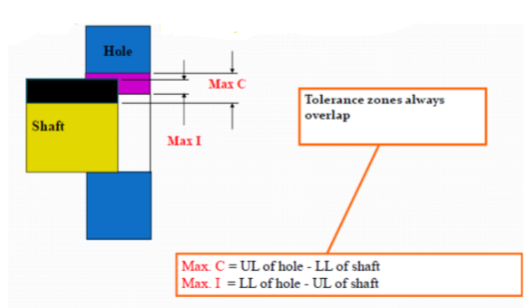
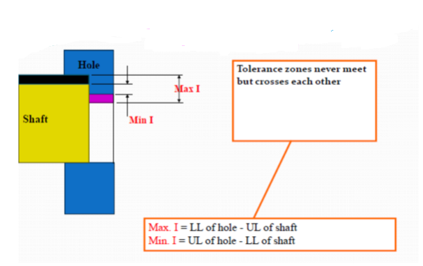

## Theory
<b> Some basic definition for understanding the limit, fit and tolerances : </b>
<b> Basic Size: </b>The size with reference to which the limits of size are fixed. 

<b> Actual Size: </b> Actual measured dimension of the part. 

<b> Zero Line: </b> It is a straight line corresponding to the basic deviations is measured from this line. The positive and negative deviations are shown above and below the zero line respectively 

 

<b> Limits of Size: </b> The two extreme permissible sizes of a part between which the actual size should lie. 

<b> Maximum Limit of Size: </b> The greater of the two limits of  size. 

<b> Minimum Limit of Size: </b> The smaller of the two limits of size. 

<b> Shaft: </b> A term used by convention to designate all external features of a part, including those which are not cylindrical. 

<b> Hole: </b> A term used by convention to designate all internal features of a part, including those which are not cylindrical. 

<b> Allowance: </b> It is the difference between the basic dimensions of the mating parts.
When the shaft size is less than the hole size, then the allowance is positive and when the shaft size is greater than the hole size, then the allowance is negative. 

<b> Tolerance: </b> It is the difference between the upper limit and lower limit of a dimension. 

<b> Tolerance Zone: </b> It is the zone between the maximum and minimum limit size. 

<b> Upper Deviation: </b> It is the algebraic difference between the maximum size and the basic size.
The upper deviation of a hole is represented by a symbol ES (Ecart Superior) and of a shaft, it is represented by es. 

<b> Lower Deviation: </b> It is the algebraic difference between the minimum size and the basic size.
The lower deviation of a hole is represented by a symbol EI (Ecart Inferior) and of a shaft, it is represented by ei. 

</b> Fundamental deviation: </b> This is the deviation, either the upper or the lower deviation, which is nearest one to zero line for either a hole or shaft. 

 

<b> Unilateral Tolerance: </b> In this system, the dimension of a part is allowed to vary only on one side of the basic size, i.e. tolerance lies wholly on one side of the basic size either above or below it.

 

<b> Bilateral Tolerance: </b> In this system, the dimension of the part is allowed to vary on both the sides of the basic size, i.e. the limits of tolerance lie on either side of the basic size. 

 

### What is Fit?

Fit is defined as the degree of freedom of tightness between the mating parts in an assembly process. Fit obtaining parts are either movable joints or fixed joints. 

#### For Example Shaft and Bearing assembly.
•	When the shaft is running in a bearing can move in relation to it thus forms a movable joint. 
•	Pulley mounted on the shaft forms a fixed joint. 

#### Different Types of Fits:
The types of fits are depending on the clearance they are. 
•	Clearance fit 
•	Transition fit 
•	Interference fit 
### Clearance fit:
•	Clearance fit is arises at the Diameter of the shaft is smaller then the hole. 
•	The minimum diameter of hole is grater then large diameter of the shaft. 
•	Clearance value is positive when in this type of fit. 
<b> Maximum Clearance: </b> It is the difference between the maximum size of hole and minimum size of shaft. 
<b> Minimum clearance: </b> It is the difference between the maximum size of shaft and minimum size of the hole.  

 

### Transition fit:
The transition fit is obtained when the diameter of the largest hole is grater then the diameter of the smallest hole. 

 

### Interference fit:
The interference type of fit the minimum allowable diameter of the shaft is larger than the maximum permissible diameter of the hole. As the diameter of the shaft is larger than the diameter of hole. 
•	The hole and shaft is intended to be attached permanently. 

 
