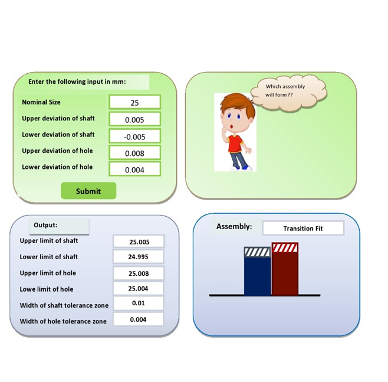

## Storyboard (Round 2)

Experiment 1: To study about limit, fit, and tolerances. 

### 1. Story Outline:

The user approaches to the simulator to understand the basic concept of shaft and assembly in which he able to find the upper and lower limit of shaft and hole respectively and tolerances zone of shaft and hole. 
After getting all the values, user will get the answer of the type of fit. 

### 2. Story:

The whole story is based on basically shaft and hole assembly. User will able to identify the hole and shaft in the simulator. User will enter the input the value and get result output value to understand the result. The whole story design process of simulation experiment is narrated as a story which consists of the description of the visual stage, the goals and objectives planned and the pathway set for learner. Moreover a few challenges and pitfalls are also set to underline and emphasize the concepts involved in the experimentation. 

#### 2.1 Set the Visual Stage Description:
The simulator starts with the name as “shaft” and “hole” and asking for the input whether user need to do find the type of fit. The simulator consists of eleven blocks: five blocks with inputs and six block with output. After getting the outputs user will get result as which type of fit which diagram. 

#### 2.2 Set User Objectives & Goals:
The main objective of this experiment is to let the user know about the type of fits. 

#### 2.3 Set the Pathway Activities:

1.	Click on the simulator tab. 
2.	Enter the value of nominal diameter of shaft. 
3.	Enter the upper and lower deviaton of shaft. 
4.	Enter the upper and lower deviation of hole. 
5.	Click on “SUBMIT” button. 

##### 2.4 Set Challenges and Questions/Complexity/Variations in Questions:
1.	In an interchangeable assembly, shafts of size 25.000-0.0100+0.040   mm mate with holes and size 25.000-0.000+0.020 mm. The maximum possible clearance in the assembly will be  
a)	10 microns  
b)	20 microns  
c)	30 microns  
<b>d)	60 microns  </b> 
2.	A hole is specified as 40 +0.000.050 mm. The mating shaft has a clearance fit with minimum clearance 0.01 mm. The tolerance on the shaft is 0.04 mm. The maximum clearance in mm between the hole and shaft is 
a)	0.04  
b)	0.05 
<b>c)	0.10 </b>
d)	0.11 

##### 2.5 Allow pitfalls:
The pitfalls in the simulator, mentioned below: 
1.	User will get an error message in a pop-up box if user press “SUBMIT” button without providing the inputs. 
2.	User will get an error message in pop-up box if user enters value more  than 1 in input block of upper and lower deviation of shaft and hole. 

##### 2.6 Conclusion:
In whole experiment, basically we get result of types of fits. 

##### 2.7 Equations/formulas: NA
1.	Upper limit of shaft =D+es  
2.	Lower limit of shaft =D+ei  
3.	Upper limit of Hole =D+ES  
4.	Lower limit of Hole =D+EI  
5.	Width of shaft tolerance zone =es-ei  
6.	Width of Hole Tolerance zone =ES-EI  

### 3. Flowchart 
 
  

### 4. Mindmap:
 
  
 
### 5. Storyboard :
 
  

<!-- Storyboard: <a href="Storyboard/storyboard.png"> [here]</a> -->
 
